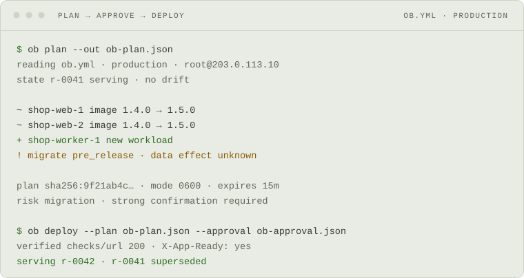

<div align="center">


# Onebox

**Plan-before-apply deploys. Zero downtime. One box.**

Production operations for one application intentionally running on one Linux
server.

[](https://github.com/labstack/onebox/actions/workflows/ci.yml) [](https://github.com/labstack/onebox/releases) [](LICENSE)

[Documentation](https://onebox.run) · [Install](https://onebox.run/start/install) · [First deploy](https://onebox.run/start/first-deploy) · [Capabilities](https://onebox.run/status/capabilities) · [Releases](https://github.com/labstack/onebox/releases)

<picture>
  <source media="(prefers-color-scheme: dark)" srcset="docs/media/deploy-dark.svg">
  
</picture>

<sub>A rendering of an example session, not a recording of one.</sub>

</div>

---

Onebox keeps the economic and cognitive simplicity of a single server without
turning production into a pile of scripts. You declare the application in
`ob.yml`; Onebox derives the Compose runtime, stable names, routing, supporting
services, and release operations.

It connects over SSH with host-key verification. There is no deployment agent
to install on the host, and nothing runs against production until you approve
the exact plan you reviewed.

## Why Onebox

| Concern | Contract |
| --- | --- |
| Change review | A digest-bound plan shows the exact config, images, host state, rendered Compose, payloads, and operation graph before apply. |
| Deployment | Health-gated rolling replacement drains traffic first and stops on failed readiness. |
| Recovery | Every release records its predecessor; interrupted work can be resumed or aborted, and a failed deploy rolls back by default. |
| Host access | Agentless SSH, key authentication, and mandatory `known_hosts` verification. An optional one-hop jump host reaches private targets, with both hops verified and the agent never forwarded. |
| Runtime ownership | Generated Compose stays inspectable with `ob preview` and can be taken over permanently with `ob eject`. |
| Automation | Human output, JSON envelopes, and NDJSON event streams come from the same lifecycle service. |

You administer Linux, SSH access, and Docker. Onebox owns the generated
application runtime inside that boundary.

## Quick start

### 1. Install the CLI

Homebrew, Scoop, release archives, and Debian/RPM packages are available. The
[installation guide](https://onebox.run/start/install) includes checksum
verification and source builds.

```sh
brew install labstack/tap/onebox   # macOS or Linux
scoop install labstack/onebox      # Windows
ob version
```

### 2. Declare the application

Starting from an existing Compose project, `ob init` writes the first draft.
This is a complete single-workload project:

```yaml
# yaml-language-server: $schema=https://raw.githubusercontent.com/labstack/onebox/main/docs/onebox.run-v1.schema.json
api_version: onebox.run/v1
app: shop
environments:
  production:
    server: root@203.0.113.10
image: ghcr.io/acme/shop:1.4.0
domain: shop.example.com
port: 3000
```

It derives the application container, Traefik routing and TLS, release layout
under `/var/lib/ob/shop`, and retention policy. `ob canonical` prints every
derived value with its source: `# default`, `# shorthand`, or `# override`.

### 3. Plan, approve, deploy

```sh
ob validate
ob canonical
ob bootstrap
ob plan --out ob-plan.json
ob approve --plan ob-plan.json --out ob-approval.json
ob deploy --plan ob-plan.json --approval ob-approval.json
```

`ob validate` and `ob canonical` are local. `ob bootstrap` is the first command
that changes the server; `ob plan` is read-only. Its artifact is mode `0600` and
expires after 15 minutes; drift or a changed local payload requires a new one.

Approval is a short-lived, digest-bound local confirmation. It is
tamper-evident ceremony, not authenticated identity or an independently issued
capability. See [Your first deploy](https://onebox.run/start/first-deploy) for
the complete walkthrough and expected output.

## Refusing is part of the contract

Onebox refuses configurations it cannot operate safely, including:

- a rolling workload without a health check;
- a cron expression whose meaning cannot be preserved;
- an unknown service driver or ambiguous workload declaration;
- a second application on an already claimed host;
- a backup policy or in-place major upgrade a service driver cannot honour.

There is no generic `--force`. Each exceptional path grants one named
capability, such as breaking a stale lock or accepting a destructive volume
change. [What Onebox refuses](https://onebox.run/explanation/what-onebox-refuses)
and [the safety envelope](https://onebox.run/explanation/safety-envelope) give
the full rules.

## Boundaries that matter

- **One host, one application, no failover.** Rolling deployment avoids an
  interruption while the server is healthy; it cannot make failed hardware
  available. Onebox is not a cluster manager, PaaS, or hosting provider.
- **PostgreSQL recovery is explicit.** Declaring `backup` is a request;
  protection begins only after `ob backup enable` establishes continuous
  archiving and takes the first base backup. Workload volumes and other service
  drivers do not have that contract today.
- **MongoDB is standalone.** Applications requiring change streams or
  multi-document transactions need a replica set, which Onebox does not manage.

[Shipped vs proposed](https://onebox.run/status/capabilities) is the complete
account of what the binary executes today and what remains direction.

## How it compares

Onebox occupies a narrow spot: one application on one Linux server, with a
review gate in front of every change. Neighbouring tools solve overlapping
problems differently, and the difference is usually the boundary rather than
the feature list.

| If you use | Where Onebox differs |
| --- | --- |
| **Docker Compose** and a few shell scripts | Compose stays the runtime — Onebox generates it, and `ob eject` hands it back permanently. What you gain is the release layer around it: health-gated rolling replacement, recorded predecessors, rollback, and backups. |
| **Kamal** | Both deploy containers over SSH with no agent on the host. Kamal spans multiple hosts and applies when you run it; Onebox is deliberately single-host and puts a digest-bound plan and an explicit approval between you and production. |
| **Dokku**, **CapRover**, **Coolify** | Those run a control plane on the server and lead with git-push or a dashboard. Onebox has no dashboard and nothing resident: a CLI over SSH, a file in your repository, and generated Compose you can read. |
| **Ansible** | Ansible configures hosts in general; you still model application releases yourself. Onebox models only the release — plan, approve, deploy, roll back — and expects you to administer the Linux host underneath it. |
| **Kubernetes** or **k3s** | A cluster reconciles desired state continuously and survives a lost node. Onebox does neither, and says so: no failover, no scheduler. It buys the operational habits — a diff before apply, health gates, recorded releases — without the cluster. |
| **Terraform** | The plan-then-apply ceremony is borrowed on purpose. The subject is different: an application release on one box, not an infrastructure graph across providers. |

## Built for people and agents

The CLI is the interface for both. Every finite machine result uses one
`onebox.run/cli/v1alpha1` envelope with a schema version, command, outcome, and
exactly one data or error value. NDJSON streams ordered operation events. Errors
are typed: branch on the code, never the sentence.

There is deliberately no MCP mutation surface. Point an agent at `ob` the way
you would point it at `gh`; every lifecycle decision still passes through the
same canonical service and safety checks. See the
[structured-output policies](https://onebox.run/reference/policies#structured-output-contracts).

## Documentation

Every page on **[onebox.run](https://onebox.run)** is also available as clean
Markdown at `<path>.md`; [llms.txt](https://onebox.run/llms.txt) maps the site
for agents.

- **Start:** [installation](https://onebox.run/start/install) and
  [your first deploy](https://onebox.run/start/first-deploy)
- **Operate:** [databases](https://onebox.run/guides/add-a-database),
  [backups](https://onebox.run/guides/back-up-a-database),
  [migrations](https://onebox.run/guides/run-migrations),
  [secrets](https://onebox.run/guides/handle-secrets), and
  [rollback](https://onebox.run/guides/roll-back)
- **Reference:** [project file](https://onebox.run/reference/project-file),
  [CLI](https://onebox.run/reference/cli),
  [errors](https://onebox.run/reference/errors), and
  [policies](https://onebox.run/reference/policies)
- **Understand:** [ownership boundary](https://onebox.run/explanation/ownership-boundary),
  [evidence, not declaration](https://onebox.run/explanation/evidence-not-declaration),
  and [generated Compose](https://onebox.run/explanation/generated-compose)

The field, CLI, and error references are generated from the binary by
`cmd/ob-docgen`, so documentation cannot silently drift from the accepted
contract.

## Development

```sh
just check       # local pre-commit gate
just e2e         # opt-in Docker end-to-end suite
just site-build  # generated references and production site
```

See [CONTRIBUTING.md](CONTRIBUTING.md) for setup, verification, and releases.
Contributions require accepting the [Contributor License Agreement](CLA.md).
Report security issues through [SECURITY.md](SECURITY.md), never a public issue.

## License

[Apache License 2.0](LICENSE) · Copyright 2026 LabStack LLC
