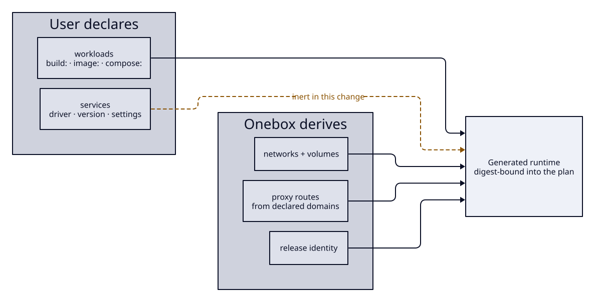
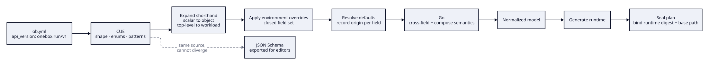
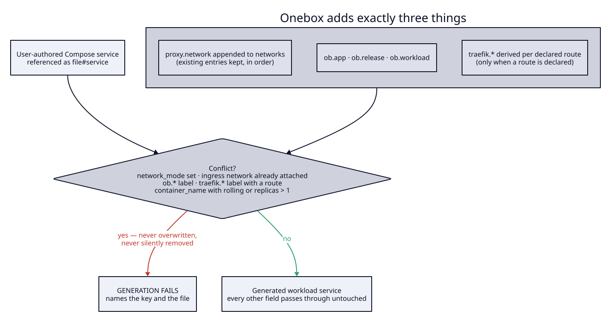

## Context

See proposal.md — Why.

The current loader treats the Compose file as the source of truth and the
project file as an annotation over it: `compose.Load` reads the user's Compose
project, `compose.Classify` attaches a component type to each service, and
`internal/engine` renders a per-release Compose file by injecting a bounded
delta — release identity, network attachment, and rollout naming — into what the
user wrote. Validation is layered: `internal/config/schema.cue` owns shape,
enums, and scalar patterns; `config.Validate` owns cross-field rules;
`compose.Classify` owns Compose-semantic rules.

That injection is the seed of this change. Onebox already generates part of the
runtime and already proves it can do so deterministically. This change widens the
generated portion from a delta to the whole file while keeping that property.

Two constraints shape the approach. The sealed-plan contract binds exact content,
so whatever generation produces has to be reproducible from the plan's own inputs
at execution time. And because the identity is redefined rather than versioned,
there is no fallback path — the new loader is the only loader from the first
commit, which raises the bar on test coverage before the adopting projects are
converted.

Diagrams are rendered from the D2 sources in `diagrams/`; run `just diagrams`
after editing one, which `just docs-check` enforces.

## Goals / Non-Goals

**Goals:**

- A contract that expresses everything the classifier contract expressed, so
  restructuring costs no capability.
- A contract that can absorb the next several years of features additively,
  because there will be no second redefinition once there are users.
- Generation that is deterministic, digest-bindable, inspectable, and reversible.
- A merge boundary with Compose-authored workloads that is enumerated rather than
  discretionary.
- A remote layout and naming scheme fixed as contract, since volume names cannot
  be changed later without moving data.

**Non-Goals:**

- No driver, convergence, tuning, backup, or tier behavior for services.
- No change to lock, fence, journal, drift, approval, verification, or rollback
  mechanics.
- No change to how images are built or how versions are cut. Build-sourced
  workloads depend on an image reference resolved by the mechanism that exists
  today until the release-pipeline change lands.
- No automatic conversion tool. Four projects are converted by hand.

## Decisions

### Redefine the identity rather than version forward

An earlier draft introduced a second identity with a dual loader and a
deprecation window. That is withdrawn. Onebox has no published release, no tags,
and no users outside this organization, so the additive-evolution promise
attached to the current identity is owed to nobody. Redefining in place removes a
second loader, a conversion capability, a comparison mode, and a release cycle of
carrying both.

The cost is real and accepted: every existing project file stops loading the day
this lands, and the four adopting projects must be converted before they can
deploy again. That is a coordinated afternoon for one person who owns all four,
and it is the last moment when it will be that cheap.

The consequence for everything after: from this change onward the contract grows
only additively. That rule is a requirement in the specification rather than a
convention, because the next person to want a clean break will not have this
excuse.

### The ownership boundary is expressed as two blocks, not three

A container that is neither built by the user nor backed by a driver — searxng,
clamav, ofelia, mailpit — is a workload sourced by image reference. The
alternative, a third category for third-party containers, was rejected: it
duplicates every workload field, and the distinction it encodes (whose source
code is it) has no operational consequence. What has consequence is whether a
driver owns the lifecycle, and that is exactly the workload/service split.

### Coverage is a requirement, not an outcome

The first draft of this design specified mechanisms — shorthand, closed
validation, escape hatch — and never specified coverage. Checked against the
schema it replaces, that draft silently dropped nine of fourteen top-level
sections, including verification, lifecycle hooks, environment files, preflight
checks, deployment order, retention, migration policy, notifications, and
registry pull credentials. Every one is used by a project in this organization
today.

A restructuring that loses shipped capability is a regression regardless of how
elegant the new shape is, so coverage is now a normative requirement with the
list enumerated, and the acceptance test is that every existing project remains
expressible.

### Shapes that will grow are open from the first commit

Additive evolution only works if a field can gain structure without changing
shape. A scalar that must later become an object is a breaking change; a scalar
that was always *also* an object is not.

Every field whose growth is already foreseeable therefore accepts both forms from
the start — the environment's server, a workload's build source, its health
check, a service declaration, and the secret configuration. Routing goes further
and accepts multiple domains and non-HTTP entrypoints immediately, because that
is not a future need: a project in this organization already serves four
hostnames including OTLP over gRPC, and a scalar domain with a scalar port cannot
express it today.

`x-` keys are reserved and ignored everywhere a mapping is accepted. In a closed
schema that costs nothing and gives both users and Onebox a place to put things
that do not yet warrant a field.

### Environment overrides are a closed set, decided now

Non-production environments differ in scale and sizing. If overrides are not in
the contract from the start they arrive later as a merge layer bolted on top —
the path Compose and Kustomize both took, and the reason neither has a
predictable precedence story.

An environment may therefore override an enumerated set of workload and service
fields, and nothing else. Overriding an unlisted field is an error naming what is
overridable; overriding an undeclared workload is an error naming it. The
resolved value reports its origin as an environment override, so it is never
mistaken for a project-level declaration.

### Normalization is a pipeline with one canonical output

Expansion happens before overrides, overrides before defaults, and all three
before cross-field checks, so those checks see one shape and every value carries
an unambiguous origin.

**Default precedence**, highest first: an explicit value in the project file; an
environment override; a value expanded from shorthand; a value derived from
another declared field; a documented contract default. There is no host-derived
tuning in this change — that arrives with drivers — so the chain takes no
environmental input and normalization stays a pure function.

### CUE stays; a JSON Schema is exported from it

`schema.cue` does shape, enums, and patterns in 251 lines against 1,172 lines of
Go, and `cue.go` rewords its errors so the validation language never reaches a
user. This contract leans harder on what CUE is good at, because the scalar-or-
object rule above turns nearly every field into a disjunction.

Alternatives considered. Hand-written Go validation gives better error text at
the cost of reimplementing closed-struct checking and every scalar constraint;
rejected because the rewording layer already closes most of that gap. Generating
the schema from Go structs inverts the dependency and loses the disjunctions;
rejected for the same reason.

The JSON Schema is exported from the same CUE source at build time, so a release
cannot publish a schema that disagrees with the contract it enforces.

### The Compose merge boundary is enumerated, and conflicts are errors

A workload sourced by a Compose reference is copied verbatim, and Onebox overlays
exactly four things: attachment to the ingress network, release identity labels,
routing derived from declared domains, and the rolling-deployment container
naming that forbids a fixed container name.

The overlay set is closed and stated in the specification. If the referenced
service already sets one of those keys, generation fails and names the conflict
rather than overwriting it — the same fail-closed posture the engine already
takes on drift. This is a real case, not a hypothetical: a project here sets
`traefik.docker.network` deliberately and documents why. The resolution is to
remove it and declare the domain instead, and conversion surfaces it rather than
letting it appear at deploy time.

Alternative considered: a general deep-merge with precedence rules. Rejected — a
deep merge is unpredictable at exactly the moment someone is debugging
production, and its rules cannot be stated in one sentence.

### The layout follows the platform convention, and is relocatable

State lives under the platform's convention for variable data a program owns and
maintains — `/var/lib/ob` — with a per-application directory, versioned release
directories, and a pointer to the active release. A reserved namespace holds
host-wide state and is refused as an application identifier.

This is what the standard prescribes for state belonging to software that
installs nothing, and it matches what comparable state-owning software does. It
is worth recording that the closest tools do not agree: Coolify uses `/data`,
Dokploy uses `/etc`, CapRover uses its own root, and Kamal — the only one sharing
this agentless, SSH-only architecture — avoids absolute system paths entirely so
it never needs elevated privileges.

Those divergences encode a real constraint rather than carelessness. `/var/lib`
sits on the root filesystem, and self-hosters routinely attach a separate data
disk; projects here already bind-mount `/data` for exactly that reason. The base
path is therefore a documented project setting rather than the current
environment-variable test hook, and it is bound into the plan so a relocation
cannot be silently disagreed about between planning and execution.

Kamal's choice also exposes an assumption worth making explicit: `/var/lib/ob`
needs privileges the deploy account may not have. Every project here deploys as
root, so this has never surfaced. Rather than decide the non-root story now, this
contract requires that the needed privileges be stated and checked before
mutation, with an actionable error — so the constraint is visible instead of
appearing as a permission failure halfway through a deploy.

### Names are derived, stable, and — for volumes — permanent

Compose project, network, and volume names derive from declared identifiers by a
documented pattern, are stable across releases so a rollback cannot orphan a
resource, are validated against the container runtime's limits, and are truncated
with a collision-resistant suffix when too long. Before generation completes,
Onebox refuses a collision with a resource it does not own, determined by its own
labels; adoption of pre-existing resources is a separate contract.

Volume names get a stronger rule: they are permanent. A later change to the
pattern that would derive a different volume name for an existing resource is a
breaking change requiring an explicit data migration, because the alternative is
an empty database and a healthy-looking deploy.

This is also why the application identifier is permanent. It names the layout,
the projects, and the volumes, so renaming it silently produces a second, empty
installation. Onebox refuses when the declared identifier disagrees with the one
recorded on the target.

### Services are generated into their own project

A supporting service is generated into a project separate from the application's,
with its own volumes, so an application release, rollback, or teardown cannot
recreate or remove it. This generalizes the pattern managed Traefik already
proves, and it is what makes the later driver work safe to build on top of.

### The generated runtime is bound into the plan by digest

The existing executable plan binds config, Compose, host state, images, rendered
Compose, and payload. This change adds the generated runtime's digest and the
configured base path. At execution the runtime is regenerated from the plan's own
inputs and compared; a mismatch is refused before any mutation.

That is what makes generation safe to trust: nobody has to believe the file
executed matches the file rendered, because execution proves it. It also forces
generation to be a pure function of recorded inputs — hence the determinism
requirement, and hence no wall-clock, no map-order, and no undeclared environment
input anywhere in the generator.

### Ejection is a one-way door

Ejection writes the generated runtime into the repository and repoints the
affected workloads at it as Compose references. From then on they follow the
Compose-referenced path, including the enumerated overlay and its conflict rules.
Onebox does not track what it previously generated and will not offer to
re-adopt.

The alternative — a reversible eject that keeps generating alongside the ejected
file — was rejected because it produces two sources of truth for one service and
no clear answer to which wins after a Onebox upgrade changes the generator.

## Risks / Trade-offs

**Every existing project breaks at once, with no fallback.** There is no second
loader to fall back to if the new one has a defect. → The four projects are
converted only after the contract's coverage requirement is verified against each
of them, and the rendered runtime of each converted project is compared against
what it runs today before it deploys.

**A generator is a compatibility surface forever.** Once users depend on the
runtime Onebox produces, changing it changes their production. → The runtime
digest is bound into plans, so a generator change surfaces as a visible diff in
the next plan rather than a silent change at execution. Generator changes that
alter output for an unchanged project are breaking and require their own change.

**Coverage is asserted, not proven, until conversion.** The enumerated list could
still miss something. → The acceptance test is not the list but the projects: if
any existing project cannot be expressed, the contract is wrong.

**The merge boundary will bite on conversion.** At least one project sets a key
in the overlay set deliberately. → It is an error naming the key and the file,
surfaced during conversion rather than at deploy time.

**Shorthand expansion can surprise.** Someone who writes top-level workload
fields and later adds a workload block may expect a merge. → Declaring both is a
validation error naming both locations, rather than a precedence rule nobody
remembers.

**Build-sourced workloads are incomplete until the release-pipeline change.** →
Generation fails closed naming the interim mechanism, and this is stated in the
specification so it cannot be read as a defect.

## Migration Plan

1. Ship the contract, generation, rendering, and ejection. Nothing deploys from a
   converted project yet.
2. Express each of the four adopting projects under the new contract. Any
   operational fact without a home is a defect in the contract, fixed before
   proceeding.
3. Compare each converted project's generated runtime against what that project
   runs today and resolve every difference.
4. Express the project that declined the previous contract. If it cannot be
   expressed, stop and revise before anything deploys.
5. Convert and redeploy the four projects one at a time, most tolerant first.

Rollback: revert the change and the converted project files together. Because
there is no dual loader, a converted project file and an older binary are
incompatible in both directions, which is why step 5 is sequential rather than
simultaneous.

## Open Questions

- Whether the ejection destination defaults to a conventional path or always
  requires an explicit one. Both satisfy the specification.
- Whether the exported JSON Schema is published to a stable URL per release or
  only shipped in the binary. This affects distribution, not the contract.
